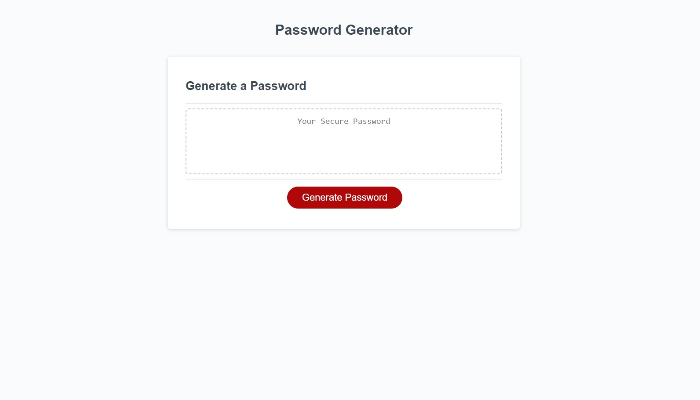

# Project Description
This is a bare-bones site which allows you to generate a completely random password based off of the input you provide. When the generate button is pressed, you will get a pop up asking how long the password should be, and what sorts of symbols you want within the password.

## Page Preview
This is what the page should look like when launched properly, or viewed on a web browser.

## Webpage Link
> **Use this link to view the webpage:** [link to the password generator webpage](https://antimatternova.github.io/Password-Challenge/)